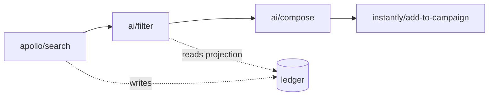

# Writing gtme docs

`docs/` is a Spandrel graph: markdown files with frontmatter, addressed by
path, linked by frontmatter and inline links. One source renders three
ways: the site at gtme.run/docs, the MCP graph at mcp.gtme.run, and
GitHub. Every rule below exists so a page reads well in all three, to a
person and to an agent, with no second copy anywhere.

This is a design doc in the Spandrel sense: decisions with reasons, so
they can be argued with.

## What the docs are not

SPEC.md and DECISIONS.md at the repo root are canon (ADR-010). The docs
explain, guide, and index; they never redefine. A page that states a
mechanism links to the SPEC section or ADR that decided it. If the two
disagree, the docs page is wrong.

START.md at the root is an instruction set, not knowledge (ADR-015). It
is the agent's entry point at gtme.run/start.md and stays one file. The
Start collection is the human-paced version of the same four ways in and
links back to it.

## Personality

Voice follows from personality, and personality follows from what the
project believes. SPEC.md §0 lists the beliefs. The four that shape how
the docs sound:

- **Errors are prompts.** A page that names a problem names the fix.
- **Every question has a deterministic answer path.** A page ends in a
  command, not in "it depends."
- **The human supervises intent and money.** A page says what spends and
  what sends, in plain words, before the command.
- **Expressive vocabulary, closed grammar.** A page uses the project's
  words and never invents structure the runner does not have.

On top of those, the docs have a character.

**Who is reading.** People who run go-to-market and are comfortable with
a terminal and an AI agent. A computer science background is not
assumed. A page never says "obviously," glosses a term like idempotency
or DAG in one line on first use, and never treats the terminal as a test
of belonging.

**Who is talking.** Someone who runs go-to-market for a living, is fluent
with a terminal and an agent, and is showing a peer how they do it now.
American, West Coast, casual on the surface and exact underneath. Smart
without ever being condescending: the reader is assumed to be as sharp
as the writer and simply newer to this. Not a vendor, not a tutorial
bot, not an engineer explaining downward. "We" is the people building
gtme and is used when we give an opinion or a recommendation: "we
recommend one delivery step per campaign." "You" is the reader. gtme
itself is "gtme" or "the runner", never "it" in a sentence where "it"
could mean something else.

The casual register shows up as habits, not slang:

- Contractions are normal. "You'll", "that's", "doesn't".
- A section opens with its point in one bold sentence, then the plain
  elaboration. The reader who only reads the bold lines gets the page.
- "So what?" is a legitimate one-line paragraph when the mechanism has
  been stated and the consequence is about to be.
- "Let's look at" and "here's" are fine ways to hand the reader an
  artifact.
- When the core idea has landed, say so and give permission to stop:
  "That's it. That's how the ledger works. Everything else is built on
  top of it."
- End a concept page with an honest opinion where there is one: what's
  missing, what we'd change, what the trade-off costs.
- No "magic," no "simply," no "just" in front of anything that took the
  reader effort.

**Opinionated, and says why.** A guide picks one way, does it, and names
the alternative in a sentence. A concept page says what the design chose
and what it gave up.

**Shows before it tells.** The first screen of a page has the artifact:
the YAML, the receipt, the query and its rows. The prose explains what
the reader just saw. The product is text, so the picture is a code
block.

**Names the practice.** GTM as code: campaigns as pipelines, adapters as
data, judgment versioned, everything replayable. The docs use that frame
and assume the reader wants to belong to it.

**Building blocks, not a system.** The reader is assembling parts with an
agent's help, not adopting a platform. Pages present adapters, steps,
groups, and bundles as things that compose, and every guide ends with
something the reader can hand to their agent and reuse.

**Calm about money.** Spend and send are stated precisely and without
drama. No urgency, no warnings in red, no "be careful." The gate ladder
is the safety story and it is told once, on its own page, then referred
to by name.

**Generous with the reader's time, stingy with words.** Short sentences.
Concrete nouns. No adjectives that could be deleted without loss. Humor
is allowed when it is dry and in service of a point, and never at the
reader's expense.

## Voice mechanics

The Google developer documentation style guide is the foundation for
everything the personality section does not cover: second person,
present tense, active voice, sentence-case headings, how to format
commands, flags, paths, and placeholders. Where Google and the
personality disagree, personality wins; the one deliberate departure is
that "we" is allowed for the project's opinions.

House rules on top of Google:

- Terminal output, receipts, YAML, SQL, and errors are code blocks, never
  screenshots. They are diffable, searchable, readable over MCP, and go
  stale visibly.
- Commands are copy-runnable as written, with the expected output shown.
- The gate-ladder vocabulary is fixed: *simulate*, *plan*, *dry-run*,
  *armed*, *spends*, *sends*. No synonyms.
- The project's nouns are fixed: adapter, binding, process adapter,
  ledger, receipt, identity key, canonical field, group, segment,
  participant, bundle. A page that needs a new noun proposes it in
  DECISIONS.md first.

## Patterns to strip

Drafts are written with a model, and models have tics. These are the ones
that show up most, drawn from Wikipedia's "Signs of AI writing," Ivo
Velitchkov's catalog of Claude clichés, and the avoid-ai-writing audit
skill. Each is a pattern. Replacing the word and keeping the shape doesn't
fix it. A page ships when a reviewer can't find any of
these in it.

**Framing tics.** The page announces its own honesty, importance, or
structure instead of being honest, important, or structured.

- The candor flag: "the honest answer," "one honest gap," "to be fair,"
  "we'd rather say so here." Say the thing.
- Significance signaling: "this matters because," "the key insight,"
  "the important thing to understand." Show the consequence instead.
- Meta-signposting: "in this section," "as we'll see," "let's break this
  down." The heading already did that.
- Stakes-raising: "shapes everything that follows," "this is where most
  people get it wrong."
- The suspense hook: "has a name," "there's a reason for that," a setup
  clause and a colon before a claim that needed no setup.

**Contrast tics.** The page manufactures an opposition so the point
lands harder.

- Negative parallelism: "not X but Y," "it's not X, it's Y," "not so much
  X as Y," "X rather than a Y." State Y.
- Negation-first: opening a sentence with what the thing isn't.
- Mirrored clauses: two parallel halves with the nouns swapped, "a
  question it answers rather than a state it keeps."
- The anticipate-and-rebut: raising an objection nobody made in order
  to dismiss it.

**Cadence tics.** The rhythm is the giveaway.

- The rule of three, especially three short sentences in a row or three
  adjectives. Two items or four read as a list; three reads as a model.
- The aphoristic ender: closing a paragraph on a quotable line.
- The deflating tail: "badly," "and no more," "which is the point," hung
  off the end of a sentence for effect.
- Uniform paragraph length.
- Em dashes as the default joint. One per page is plenty.

**Word tics.** These appear far more in model output than in human
writing of the same genre and are banned outright: delve, leverage,
robust, seamless, nuanced, crucial, pivotal, underscore, testament,
tapestry, landscape, unlock, load-bearing, hand-waving, genuinely,
truly, "the real question," "here's the thing," "here's where," "falls
out of," "follows directly," "serves as," "boasts," "in other words,"
"it's worth noting," "importantly," "notably," "arguably."

**Structural tics.** Bullet lists of bare noun phrases with no verbs;
bold on whole sentences mid-paragraph; a "challenges and future"
closing section; a summary that restates the page; a "hope this helps"
closer of any kind.

Two habits from the [personality](#personality) section look like tics
and are kept on purpose: the bold lead sentence that opens a section,
and "That's it" as the permission to stop. Both come from how the
explainer already writes. They stay because the reader can skim on the
first and relax on the second, and because a page uses each of them
once.

## Context comes from the graph, not from prose

A page is entered from anywhere: search, an MCP `context` call, a link
from another page. Its context is carried structurally, not in an
opening paragraph:

- `description` is the one-sentence definition.
- `links` with their descriptions say what the page depends on and what
  depends on it. Backlinks are generated.
- The site renders the description under the title and the linked
  pages in a "Related" block, so a human sees what an agent sees.

The prose rule that remains: never reference reading order. No "as we saw
above," no "in the next section." Link to the page instead.

## Collections and page shapes

The four collections are Diátaxis quadrants. Each has one job and one
shape; a page that does two jobs is two pages.

### Start

Job: get from nothing to a receipt. One page per way in, plus Install and
For agents. Shape: what this page needs, what it spends, the commands in
order, the receipt you get, the one next page. One sentence of
explanation per step at most; the Concepts links carry the rest.

### Concepts

Job: explain one idea so the reader can predict behavior. These pages
are the atoms; guides and reference link into them. Shape:

1. **The artifact.** A YAML fragment, a command and its output, or a
   query and its rows. First thing on the page.
2. **What you just saw.** Two or three paragraphs naming the parts.
3. **Why it is this way.** The decision, linked to its ADR or SPEC
   section, and what was given up.
4. **Where it shows up.** Links to the guides and reference pages that
   depend on it.

Concept pages are ordered simplest to most complex along one spine:
author a file, run it safely, understand what the run remembered, grow
knowledge across runs, extend the tool. The `order` key carries that
sequence.

### Guides

Job: accomplish one task. Shape:

1. **Goal.** One sentence: what you have at the end.
2. **Before you start.** Links to the concepts and the start page that get you
   to the starting state; keys required; what this guide spends and
   sends.
3. **Steps.** Numbered. Each step is one command or one edit, followed by
   the output or the diff that proves it worked.
4. **What you have now.** The artifact, and how to check it.
5. **Next.** At most three links.

The eight operator stories (launch, guard, report, interrogate, top up,
iterate, recover, segment) are guides. Each quotes its SPEC invariant
under the goal, because the guide is the non-normative enactment of it.

### Reference

Job: look one thing up. Shape is a table before prose: signature or
keys, then one example, then see-also. Terraform's provider and command
pages are the model. CLI verbs, adapters, and canonical fields are
generated from `gtme help --agent` and the spec files. Do not hand-edit a
generated page; fix the source and regenerate. The generator marks its
output with a comment on the first line.

## Frontmatter

```yaml
---
name: Identity keys
description: How the same person or company is the same record across runs and vendors
for: "You've seen two vendors disagree about one person, or you're about to import a CSV and want to know what makes a row the same record"
learn:
  - "the key tiers and the order they're tried in"
  - "what happens when a weak key later gains a stronger one"
order: 6
links:
  - to: /concepts/ledger
    type: relates-to
    description: Identity keys are the primary key of the identities table the ledger is built on
  - to: /reference/ledger-schema
    type: relates-to
    description: The DDL for identities and field_values
---
```

- `for` is one sentence saying who the page is for and when: the state
  the reader is in. "You've run a pipeline twice and want to know why
  the second run was cheaper." An agent reads it to decide whether to
  send someone here.
- `learn` is two to four items, each a verb phrase or a question the page
  answers. The site renders `for` and `learn` as a "What you'll learn"
  block under the title. Both are frontmatter, not prose, so an agent
  gets them as data and the word budget doesn't count them.
- `name` is the sidebar and MCP title. Sentence case, no trailing period.
- `description` is one sentence under 160 characters. It is what an
  agent reads before deciding to open the page, so it is the definition,
  not a teaser.
- `order` is an integer; siblings sort by it. Spandrel sorts by path and
  ignores it; the site honors it.
- Every link carries a `description`. Spandrel treats it as the meaning
  of the edge; `type` is scaffolding. A link without a description is a
  link the author could not justify.
- Inline `[text](/path)` links also become edges. Use one for the first
  mention of a concept on a page, with the concept's name as the text.

Link types in use: `relates-to`, `depends-on`, `decided-by` (an ADR or
SPEC section), `example-of` (a bundle or example that demonstrates a
concept). Add a type only when an existing one would mislead.

## Graphics

Three kinds, each with a rule. The test for all three: a reader who gets
only the text still gets the meaning.

### 1. Text is the primary graphic

Receipts, YAML, SQL, and terminal output are code blocks. The receipt
table is the most important picture in the project and it is text.

### 2. Structure diagrams are Mermaid

Anything that shows structure (a pipeline's steps, the ledger between
them, a group feeding a second stage, the adapter tiers) is a Mermaid
block in the markdown. Mermaid is text, so GitHub renders it, the site
renders it, and an agent reading over MCP gets the diagram itself instead of an
alt-text summary of it. The source is the fallback.



One grammar: steps are boxes in a row labeled by adapter id, the ledger
is a cylinder, solid arrows are record flow, dotted arrows are ledger
reads and writes. The site's Mermaid theme uses the same tokens as the
rest of the page. Hand-drawn SVG is reserved for the few pictures
Mermaid cannot express well, kept in `docs/_assets/` (the underscore
keeps it out of the graph), with a full-sentence alt text.

A diagram shows a mechanism. If it would still be correct with the
labels removed, it is decoration and is cut.

### Pipeline figures are generated from the YAML on the page

The site draws a figure beside any YAML block that is a whole pipeline:
a `source:` with a `use:` and a `steps:` list where every step has an
`id` and a `use`. Source at the top, one box per step labeled with its
id and adapter, `when:` drawn as a gate on the hop it guards, the ledger
as a bus alongside with a tap for every step that reads it (`cache:`,
`idempotency:`, an `ai/*` judgment). GitHub and MCP readers get the YAML,
which is the source of the figure and complete without it. The rules
this puts on a page:

- Show the whole file. A pipeline block trimmed with `...`, or shown as
  `steps:` without its `source:`, gets no figure. Fragments (`limit: 5`,
  a single step) are fine as fragments; they are not pipelines.
- Name a step by its id in code font when the prose talks about it: "the
  `reveal` step", "read the `score` row". The id is the figure's label
  and the receipt's first column, so one token names all three.
- Don't hand-draw the same pipeline in Mermaid. Two drawings of one file
  drift. Mermaid stays for structure that isn't one pipeline file: the
  ledger between steps, a group feeding a second stage, the adapter
  tiers.
- One pipeline file per page where the page is about a file. A page that
  shows two whole pipelines gets two figures, which is rarely what the
  reader needs.

`gtme plan --viz` is the long-term source for this figure and needs an
ADR before the docs depend on it; the site parses the YAML itself until
then.

### 3. Motion is Remotion

Animation is for pages where time is the subject: a run moving through
its steps, a second run cache-skipping the first, a killed run resuming,
the gate ladder tightening from simulate to armed. Structure gets
Mermaid; change over time gets a composition.

Compositions live in the shorts-factory repo as a `projects/gtme/`
project, next to the existing spandrel and elegant-atomics projects. That
repo already has the scene kit, a phase clock, and a loader that turns a
project's DESIGN.md frontmatter into render tokens, so gtme's tokens are
declared once in `projects/gtme/DESIGN.md` and every composition and
every Mermaid theme reads the same values.

Each composition renders two files into `docs/_assets/anim/`: `<id>.webm`
and `<id>.png`, the poster, taken from the final frame so the still is a
complete diagram on its own. The markdown references only the poster:

```markdown

```

The convention is the contract: an image under `_assets/anim/` is the
poster for a video of the same name. The site's renderer swaps it for a
looping, muted `<video>` with the poster as its first frame. GitHub and
MCP show the poster and the alt text. No Remotion runtime ships in the
site; the player is only worth adding if a composition needs props or
scrubbing.

Rules for a composition:

- Under twelve seconds, loops cleanly, no audio.
- The text on screen uses the page's vocabulary. If the animation needs
  a word the page does not use, the page is missing a sentence.
- The numbers in the animation are the numbers in the receipt beside it.
- Posters are rendered, never hand-edited, so they cannot drift.

Remotion is free for individuals and companies of up to three people and
needs a company license above that. CONTRIBUTING notes this when the
first composition lands.

## References

- **Google developer documentation style guide** for mechanics.
- **Diátaxis** for the four collections and one job per page.
- **Terraform docs** for reference-page shape and the product shape
  (declarative file, CLI verbs, provider catalog, plan then apply).
- **Spandrel's patterns collection** for linking discipline and
  high-signal descriptions.
