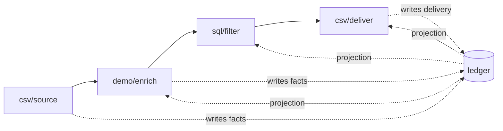

# The ledger

Run a three-person CSV through a pipeline, then ask what gtme knows about one of them:

```sh
gtme show jane.doe@acme.com
```

```json
{
  "entity_type": "person",
  "identity_key": "jane.doe@acme.com",
  "fields": {
    "company_domain": "acme.com",
    "demo.note": "synthetic — demo/enrich called no vendor",
    "demo.score": 100,
    "email": "jane.doe@acme.com",
    "full_name": "Jane Doe",
    "title": "VP Marketing"
  },
  "deliveries": [
    {
      "target": "csv/deliver",
      "scope": "out.csv",
      "status": "accepted",
      "run_id": "01M3CNWQWEYGN7C6G0Q9CDH7E3",
      "created_at": "2026-09-25T16:20:35.864Z"
    }
  ]
}
```

That's the ledger, seen through one record. Four fields came from the CSV, two came from an enrichment step, and one delivery went out. The [receipt](/concepts/runs-and-receipts) you saw when the run finished is a summary of the same rows. Every one of those is a row in a SQLite file at `~/.gtme/ledger.db`, and the file is what a pipeline reads from and writes to.

## What you just saw

**Steps don't hand records to each other. They read from the ledger and write back to it.** A source step (an [adapter](/concepts/adapter-tiers) in the source role) writes the CSV rows in as facts. The enrichment step reads the fields it declared it needs and writes its results back as new facts. The filter step reads the score and writes a verdict; the delivery step reads its variables and writes a delivery row. Nothing travels between steps except the list of which identities are in play.



What a step reads is called a *projection*: the current value of each field it asked for, and nothing else. A compose step that needs `full_name` and `title` never sees `demo.score`. Because a step only ever gets the fields it declared, it stays small, and so does the adapter behind it.

**Facts are append-only.** When an enrichment writes `demo.score = 100`, that's a new row in `field_values`, not an update to an old one. Run the pipeline again next month and get a different score, and you'll have two rows. The current value is decided at read time, by a view:

```sql
CREATE VIEW current_fields AS
SELECT identity_id, field, value, source, confidence, run_id, created_at
FROM field_value_ranks
WHERE rank = 1;
```

`field_value_ranks` orders every row for a field by confidence, then by recency. The highest-confidence, newest row wins. You keep the whole history, and the ledger computes the current value whenever something asks for it.

**Every fact records where it came from.** Here are the same six fields through `gtme query`, with the columns `show` folds away:

```sh
gtme query "SELECT field, value, source, confidence FROM current_values
            WHERE identity_id = (SELECT id FROM identities WHERE identity_key = 'jane.doe@acme.com')"
```

```
{"field":"company_domain","value":"acme.com","source":"csv/source@1","confidence":1}
{"field":"demo.note","value":"synthetic — demo/enrich called no vendor","source":"demo/enrich@1","confidence":1}
{"field":"demo.score","value":100,"source":"demo/enrich@1","confidence":1}
{"field":"email","value":"jane.doe@acme.com","source":"csv/source@1","confidence":1}
{"field":"full_name","value":"Jane Doe","source":"csv/source@1","confidence":1}
{"field":"title","value":"VP Marketing","source":"csv/source@1","confidence":1}
```

`source` is the adapter that wrote the fact, with its version. `run_id` (not shown) is the run it happened in. When two vendors disagree about someone's title, you can see both rows, which one won, and why.

**There are three layers, and only the first one is the cache.**

| Layer | Tables | Lives for |
|---|---|---|
| Identity | `identities`, `field_values`, `relations` | Forever. This is what makes the second run cheap. |
| Runs | `runs`, `run_records`, `step_events`, `costs`, `deliveries` | Per execution. This is where receipts and resume come from. |
| Groups | `groups`, `group_events` | Forever. Decisions about sets of identities. |

Plus `payloads`, which holds raw vendor responses as a purgeable cache. A payload isn't a fact until an adapter extracts fields from it, and `gtme vacuum` can throw it away.

## So what?

Run the same pipeline a second time, against the same CSV:

```
run 01M3CNWQXCNSQXNZ3HF7Y7GM6P — done
step    adapter      in  out  empty  cached  filtered  failed  cost  avoided
source  csv/source   0   3    -      0       -         -       $0    -
score   demo/enrich  3   0    -      3       -         -       $0    $0.0300
keep    sql/filter   3   1    -      0       2         -       $0    -
out     csv/deliver  1   0    -      1       -         -       $0    $0.0000
total: $0 spent, $0.0300 avoided via cache (4 records skipped)
```

The enrichment step saw three records, found a fresh `demo.score` for each in the ledger, and called nothing. The delivery step saw Jane, found a delivery row with the same idempotency key (the email, in this pipeline), and wrote nothing. Idempotency here means: the same key, delivered to the same target, is a no-op the second time.

There is no cache step and no dedupe step, and the pipeline file has no line about either. Both happen because each fact sits in a table with a source, a time, and an identity, so a step can check what it already has before it does anything.

The same tables are behind resume and receipts. `run_records` stores each identity's last completed step, so a killed run picks up from there. `costs` has a row per identity per step, so a receipt can say what each step cost. And a segment is a `SELECT` over `current_values`, so there was never a segment feature to build.

That's it. That's the ledger, and everything else in gtme is built on top of it.

## Why it's this way

**The obvious design was to forward every field from each step to the next.** Most workflow tools do this. It works until a step needs to know what happened last month, or two vendors disagree, or a run dies halfway. At that point you end up building a database inside the stream. [ADR-002](/decisions#adr-002) put the database first and made the steps read from it, which is where caching, segmentation over history, resume, and receipts all come from.

**The current-value rule lives in exactly one place.** [ADR-003](/decisions#adr-003) moved the projection out of Go and into a SQL view. The runner and `gtme query` read the same view, so they can't drift apart on what "current" means. SPEC.md [§3](/spec#3-ledger-schema--decided) requires that no second implementation of the ranking exists.

**What it costs.** Every step reads and writes SQLite, which caps per-record throughput below what a streaming design could do. For outbound, where the vendor call is the slow part and a big run is a few thousand records, we haven't hit that cap. If you need to push millions of rows through, gtme is the wrong tool.

**What it doesn't do yet.** The ledger is one file on one machine. That's the right default for one operator or one agent working a campaign, and it's why there's nothing to set up. It also means two people can't share a ledger without sharing the file. Sharing a ledger between people isn't something gtme does today.

## Where it shows up

- [Identity keys](/concepts/identity-keys) decide which row a vendor's record lands on. The ledger is only as good as the keying.
- [Facts](/concepts/facts) is the deeper cut on `source`, `confidence`, and freshness, and what happens when they conflict.
- [The gate ladder](/concepts/gate-ladder) is the ledger written in stages: plan writes nothing, dry-run writes facts and no deliveries, and armed writes everything.
- [Groups](/concepts/groups) are the third layer, where a set of identities becomes a thing you can name, deliver to, and source from.
- [`gtme show`](/reference/cli/show), [`gtme query`](/reference/cli/query), and [the schema](/reference/ledger-schema) are the lookup pages.
