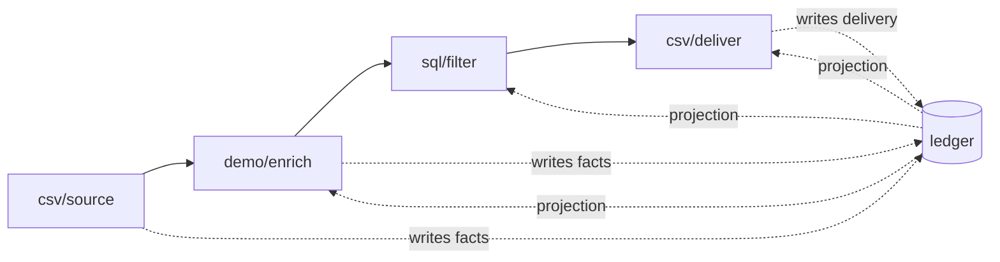

# The ledger

After [See it run](/start/show-me) runs `hello.yaml`, ask what gtme knows about one of its three people:

```sh
gtme show jane.doe@acme.com
```

```json
{
  "deliveries": [
    {
      "created_at": "2026-09-26T17:14:11.355Z",
      "run_id": "01M3FBBK0M8B0DSG8T6Z4CWQ8Q",
      "scope": "out.csv",
      "status": "accepted",
      "target": "csv/deliver"
    }
  ],
  "entity_type": "person",
  "fields": {
    "company_domain": "acme.com",
    "demo.note": "synthetic — demo/enrich called no vendor",
    "demo.score": 100,
    "email": "jane.doe@acme.com",
    "full_name": "Jane Doe",
    "title": "VP Marketing"
  },
  "identity_key": "jane.doe@acme.com",
  "identity_key_tier": "email"
}
```

That's the ledger, seen through one record. Four fields came from the CSV, two came from an enrichment step, and one delivery went out. The run's [receipt](/concepts/runs-and-receipts) is a summary of the same rows. Each is a row in a SQLite file, one ordinary database file on your machine, at `~/.gtme/ledger.db`, and the file is what a [pipeline](/concepts/pipeline) reads from and writes to. [Identity keys](/concepts/identity-keys) explains the last two lines.

## What you just saw

**Steps don't hand records to each other. They read from the ledger and write back to it.** The source, an [adapter](/concepts/adapter-tiers) in the source [role](/concepts/steps-and-roles), writes the CSV rows in as facts. Every later step reads the fields it declared and writes its result back as a fact: a score, a keep-or-drop verdict, or a delivery. Nothing travels between steps except the list of which identities are in play.


```mermaid
flowchart LR
  source[csv/source] --> score[demo/enrich] --> keep[sql/filter] --> out[csv/deliver]
  ledger[(ledger)]
  source -. writes facts .-> ledger
  ledger -. projection .-> score
  score -. writes facts .-> ledger
  ledger -. projection .-> keep
  ledger -. projection .-> out
  out -. writes delivery .-> ledger
```

What a step reads is called a *projection*: the current value of each field it asked for, and nothing else. A compose step that needs `full_name` and `title` never sees `demo.score`, so the adapter behind it handles only the fields it asked for.

**Facts are append-only.** When an enrichment writes `demo.score = 100`, that's a new row in `field_values`, not an update to an old one. Run the pipeline again next month and get a different score, and you'll have two rows. The current value is decided at read time, by a view, a saved query the ledger reruns whenever you read it:

```sql
CREATE VIEW current_fields AS
SELECT identity_id, field, value, source, confidence, run_id, created_at
FROM field_value_ranks
WHERE rank = 1;
```

The highest-confidence, newest row wins. `current_values` is built on this view with each value unwrapped from JSON, and it's the one to use in your own SQL.

**Every fact records where it came from.** Here are the same six fields through `gtme query`, with the columns `show` folds away:

```sh
gtme query "SELECT field, value, source, confidence FROM current_values
            WHERE identity_id = (SELECT id FROM identities WHERE identity_key = 'jane.doe@acme.com')"
```

The output is one row per line:

```
{"confidence":1,"field":"company_domain","source":"csv/source@1","value":"acme.com"}
{"confidence":1,"field":"demo.note","source":"demo/enrich@1","value":"synthetic — demo/enrich called no vendor"}
{"confidence":1,"field":"demo.score","source":"demo/enrich@1","value":100}
{"confidence":1,"field":"email","source":"csv/source@1","value":"jane.doe@acme.com"}
{"confidence":1,"field":"full_name","source":"csv/source@1","value":"Jane Doe"}
{"confidence":1,"field":"title","source":"csv/source@1","value":"VP Marketing"}
```

`source` is the adapter that wrote the fact, with its version, and `run_id` (not shown) is the run it happened in. [Facts](/concepts/facts) shows two sources disagreeing about one field, and which one won.

**The ledger has three layers.**

| Layer | Tables | Lives for |
|---|---|---|
| Identity | `identities`, `field_values`, `relations` | Forever. This is what makes the second run cheap. |
| Runs | `runs`, `run_records`, `step_events`, `costs`, `deliveries` | Per execution. This is where receipts and resume come from. |
| Groups | `groups`, `group_events` | Forever. Decisions about sets of identities. |

`payloads` sits beside them and holds raw vendor responses, which no step reads and [`gtme vacuum`](/reference/cli/vacuum) deletes.

**A second run reads what the first one wrote.** Run `hello.yaml` again against the same CSV:

```
run 01M3FBBK2S1DDWKWTW6WY02YK7 — done
step    adapter      in  out  empty  cached  filtered  failed  cost  avoided
source  csv/source   0   3    -      0       -         -       $0    -
score   demo/enrich  3   0    -      3       -         -       $0    $0.0300
keep    sql/filter   3   1    -      0       2         -       $0    -
out     csv/deliver  1   0    -      0       -         -       $0    -
out: 1 already delivered
total: $0 spent, $0.0300 avoided via cache (3 records skipped)
```

The enrichment step saw three records, found a `demo.score` for each still inside `demo/enrich`'s 30-day cache window, and called nothing. The delivery step saw Jane, found a delivery row with the same idempotency key, her email, and wrote nothing, which the receipt counts as `already delivered`. The same key, delivered to the same target, is skipped the second time.

Neither the cache nor the dedupe is a step of its own. The pipeline names the key with `idempotency: email`, and the rest comes from the tables. Each fact has a source, a time, and an identity, so a step checks what the ledger already has before it does anything.

The same tables are behind resume and receipts. `run_records` stores each identity's last completed step, so a killed run picks up from there. `costs` has a row per identity per step, so a receipt can say what each step cost. And a segment, a saved query over `current_values`, is only a `SELECT`, so there was never a segment feature to build.

That's it. That's the ledger. Receipts, resume, segments, and the cache are all reads of it.

## Why it's this way

**The obvious design was to forward every field from each step to the next.** Most workflow tools do this. It works until a step needs to know what happened last month, or two vendors disagree, or a run dies halfway. At that point you end up building a database inside the stream. The decision record [ADR-002](/decisions#adr-002) put the database first and made the steps read from it, which is where caching, segmentation over history, resume, and receipts all come from.

**The current-value rule lives in one view.** The runner and `gtme query` read the same view, so they can't disagree about what "current" means ([ADR-003](/decisions#adr-003), [SPEC §3](/spec#3-ledger-schema--decided)).

**What it costs.** Every step reads and writes SQLite, which caps per-record throughput below what a streaming design could do. For outbound, where the vendor call is the slow part and a big run is a few thousand records, we haven't hit that cap. If you need to push millions of rows through, gtme is the wrong tool.

**What it doesn't do yet.** The ledger is one file on one machine. That's the right default for one operator or one agent working a campaign, and it's why there's nothing to set up. Sharing a ledger means sharing the file.

## Where it shows up

- [The gate ladder](/concepts/gate-ladder) is the ledger written in stages: plan writes nothing, dry-run writes facts and no deliveries, and armed writes everything.
- [Groups](/concepts/groups) are the third layer, where a set of identities becomes a thing you can name, deliver to, and source from.
- [Top up](/guides/top-up) reruns a campaign and pays only for what the cache doesn't already hold.
- [Recover](/guides/recover) resumes a run that died, from the rows in `run_records`.
- [`gtme show`](/reference/cli/show), [`gtme query`](/reference/cli/query), and [the schema](/reference/ledger-schema) are the lookup pages.
