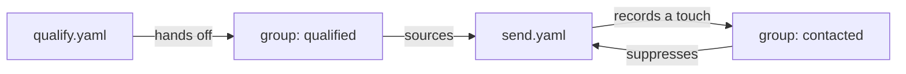

# Multi-stage campaigns with groups

**Goal: two pipelines with a reviewed group between them.** The first decides who qualifies, and re-running it never sends anything. The second works that list two people a run, and you arm it by hand. A contact history both campaigns share keeps anyone from being reached twice.



## Before you start

**You need `gtme` ([Install](/start/install)), and it helps to have read [Groups and segments](/concepts/groups).**

**This guide needs no API keys and sends nothing past your own disk.** The only priced [step](/concepts/pipeline) is `demo/enrich`, a pretend $0.01 per record that calls no vendor. Both deliveries write local files. The CSV comes from the shipped `qualify-group-send` [bundle](/concepts/campaign-is-a-folder), which is this split with a model judge and an Instantly send, and which needs keys to arm.

## Steps

Build both stages and run them in order:

1. Make a folder with its own [ledger](/concepts/ledger), and fetch an eight-person CSV:

    ```sh
    mkdir -p multi-stage && cd multi-stage
    export GTME_LEDGER=./ledger.db
    curl -fsSLO https://raw.githubusercontent.com/gtme-run/gtme/main/bundles/qualify-group-send/1-qualify/people.csv
    ```

1. Save stage 1 as `qualify.yaml`:

    ```yaml
    name: qualify
    version: 1

    source:
      use: csv/source
      with:
        path: people.csv
        columns: { full_name: Full Name, email: Email, title: Title, company_name: Company, company_domain: Company Website }

    steps:
      - id: score
        use: demo/enrich
        with:
          cost_per_record_usd: 0.01

      - id: worth-it
        use: sql/filter
        with:
          query: >
            SELECT identity_id FROM current_values
            WHERE field = 'demo.score' AND CAST(value AS INTEGER) >= 50

      - id: handoff
        use: group/deliver
        with: { group: qualified }
        variables:
          name: full_name
          title: title
          score: demo.score
    ```

    `score` rates each person, and `worth-it` keeps anyone at 50 or more. `handoff` is a [deliver](/concepts/steps-and-roles) step whose target is the `qualified` group, and its `variables:` are what you'll review.

1. Save stage 2 as `send.yaml`:

    ```yaml
    name: send
    version: 1

    source:
      group: qualified
      limit: 2
      once: true

    steps:
      - id: opener
        use: text/compose
        uses: [full_name, company_name]
        provides: [opener]
        with:
          template: "{{ record.full_name }}, a quick question about outbound at {{ record.company_name }}."

      - id: out
        use: csv/deliver
        with:
          path: outbox.csv
        variables:
          name: full_name
          opener: send.opener
        idempotency: email
        record: contacted
        suppress: { group: contacted, within: 30d }
    ```

    `opener` reads the fields in `uses:` and writes `opener`, which the file stores as `send.opener`. The source serves at most 2 members a run, oldest-added first, and `once: true` skips members this pipeline already finished. `record: contacted` writes a touch per delivery, and `suppress:` holds back a send to anyone touched in `contacted` in the last 30 days.

1. [Plan](/concepts/gate-ladder) stage 2 before stage 1 has run:

    ```sh
    gtme plan send.yaml
    ```

    It prints:

    ```
    gtme: 2 plan problems:
      - group "contacted" does not exist — create it with `gtme groups add contacted <identity-key>...` or snapshot a segment with `gtme groups add contacted --from-segment <name>`
      - group "qualified" does not exist — create it with `gtme groups add qualified <identity-key>...` or snapshot a segment with `gtme groups add qualified --from-segment <name>`
    ```

    Plan catches a missing group before anything runs, and here both are missing. Stage 1 will create `qualified`. A group that `record:` writes is created at run time, but `suppress:` needs it to exist first, so create `contacted` empty, typed for people:

    ```sh
    gtme groups add contacted --type person
    ```

    It prints:

    ```
    group contacted: 0 added, 0 unchanged
    ```

1. Dry-run stage 1:

    ```sh
    gtme run qualify.yaml --dry-run
    ```

    The output is similar to the following:

    ```
    ...
    handoff: 5 record(s) would be handed off to group "qualified" (held back — dry run)
    handoff: resolved variables for 5 record(s) — review, then run again without --dry-run to arm:
      jane.doe@acme.com
        name: "Jane Doe"
        score: "100"
        title: "VP Marketing"
    ...
      erin@umbrella.example
        name: "Erin Park"
        score: "76"
        title: "Software Engineer"
    ...
    total: $0.0800 (estimated) spent
    ```

    A dry-run runs every step except deliveries, so `score` spends its pretend $0.08 here and the armed run reads it from cache. This list is the review of the handoff. Erin scored well and isn't a buyer. Stage 2 reads the group, not this list, so you arm the handoff and take her out of the group before stage 2 runs.

1. Arm stage 1, the same command without the flag:

    ```sh
    gtme run qualify.yaml
    ```

    The last lines are:

    ```
    handoff: 5 record(s) handed off to group "qualified"
    total: $0 spent, $0.0800 avoided via cache (8 records skipped)
    ```

1. Review the group, and take Erin out with a reason:

    ```sh
    gtme groups show qualified
    gtme groups remove qualified erin@umbrella.example \
        --note "engineer, not a buyer"
    ```

    The output is similar to the following:

    ```
    group qualified (person) — 5 member(s)
      person:bob@globex.io
      person:carol@initech.dev
      person:erin@umbrella.example
      person:jane.doe@acme.com
      person:lee@vandelay.example
    written by:  qualify
    sourced by:  (none)
    ...
    group qualified: 1 removed, 0 unchanged
    ```

    `gtme groups show` lists who's waiting in the group and which pipelines write and read it.

1. Run stage 1 again:

    ```sh
    gtme run qualify.yaml
    ```

    The receipt is the following, trimmed:

    ```
    ...
    step      adapter        in  out  empty  cached  filtered  failed  cost  avoided
    source    csv/source     0   8    -      0       -         -       $0    -
    score     demo/enrich    8   0    -      8       -         -       $0    $0.0800
    worth-it  sql/filter     8   5    -      0       3         -       $0    -
    handoff   group/deliver  5   0    -      5       -         -       $0    ?
    ...
    ```

    All 5 handoffs count as cached, because gtme already recorded each one as a delivery and won't make it twice ([idempotency](/concepts/runs-and-receipts)), so Erin stays out. The `?` means the handoff has no price to avoid. Stage 1 has no send in it, so re-running it can't contact anyone.

1. See why the send lives in its own file. Copy `qualify.yaml` to `combined.yaml`, change its `name:` to `combined`, append an `out` step like the one in `send.yaml`, and plan it:

    ```sh
    gtme plan combined.yaml
    ```

    The output includes:

    ```
    warning: one commit point: this pipeline both hands off — handoff (→ group "qualified") — and sends — out (→ csv/deliver). Arming approves every deliver step at once, so approving the handoff approves the send; keep the handoff in its own pipeline and let the send consume the group.
    ```

    In one file, arming the handoff also arms the send, so there's no moment to review the group in between. Delete `combined.yaml`; the rest of the guide doesn't use it.

1. Dry-run stage 2:

    ```sh
    gtme run send.yaml --dry-run
    ```

    The output is similar to the following:

    ```
    run 01M3MDA6GA2HHCPCX3GWTF5RCJ (send)
    source: sourced 2 members of group "qualified" (4 of 4 not yet worked; limit 2, oldest first)
    ...
    out: resolved variables for 2 record(s) — review, then run again without --dry-run to arm:
      jane.doe@acme.com
        name: "Jane Doe"
        opener: "Jane Doe, a quick question about outbound at Acme Inc."
      bob@globex.io
        name: "Bob Stone"
        opener: "Bob Stone, a quick question about outbound at Globex."
    total: $0 spent
    ```

    Stage 2 has its own dry-run and its own receipt, and this is where you read the lines before they send.

1. Arm stage 2. Run this three times:

    ```sh
    gtme run send.yaml
    ```

    The source line from each run is:

    ```
    source: sourced 2 members of group "qualified" (4 of 4 not yet worked; limit 2, oldest first)
    source: sourced 2 members of group "qualified" (2 of 4 not yet worked; limit 2, oldest first)
    source: sourced 0 members of group "qualified" (0 of 4 not yet worked; limit 2, oldest first)
    ```

    The dry-run finished nobody, so the first armed run still saw 4 to work. Each armed run advanced by 2, and the third found nothing left.

1. Add a person to the CSV, and run both stages:

    ```sh
    cat >> people.csv <<'EOF'
    Dana Park,dana@contoso.com,Head of Growth,Contoso,contoso.com
    EOF
    gtme run qualify.yaml
    gtme run send.yaml
    ```

    The output includes:

    ```
    total: $0.0100 (estimated) spent, $0.0800+? avoided via cache (13 records skipped)
    ...
    source: sourced 1 members of group "qualified" (1 of 5 not yet worked; limit 2, oldest first)
    ```

    Stage 1 paid to score Dana only and handed her off. `13 records skipped` counts every skip across both steps, and the `+?` means some of them have no price. Stage 2 served Dana and nobody else. If stage 1 runs every morning without you, stage 2's dry-run is your review: read it, remove anyone you reject from `qualified`, then arm stage 2. `gtme plan send.yaml` prints the same count before a run, as `5 member(s), 1 not yet worked, sourcing 1`.

1. Save a second campaign as `webinar.yaml`, and run it:

    ```yaml
    name: webinar
    version: 1

    source:
      group: qualified

    steps:
      - id: invite
        use: csv/deliver
        with:
          path: webinar.csv
        variables:
          name: full_name
        idempotency: email
        record: contacted
        suppress: { group: contacted, within: 30d }
    ```

    ```sh
    gtme run webinar.yaml
    ```

    The output is similar to the following:

    ```
    ...
    invite: 5 record(s) suppressed:
      jane.doe@acme.com: touched in "contacted" 16s ago
      bob@globex.io: touched in "contacted" 16s ago
      carol@initech.dev: touched in "contacted" 16s ago
      lee@vandelay.example: touched in "contacted" 16s ago
      dana@contoso.com: touched in "contacted" 6s ago
    total: $0 spent
    ```

    `webinar.csv` is a new target, so idempotency alone would let all 5 through. After 30 days the rule lets them through again; set a longer `within:` for a longer one. Three things stop repeats on this page:

    - `once:` stops stage 2 serving a member it already finished.
    - Idempotency stops the same delivery to the same target.
    - `suppress:` stops a second campaign within the window.

## What you have now

**You have two stages with a reviewed group between them, and a contact history every campaign checks.**

```sh
gtme groups
```

```
group      type    members  added  removed  touched  created
contacted  person  0        0      0        5        2026-09-28
qualified  person  5        6      1        0        2026-09-28
qualify    person  0        0      0        6        2026-09-28
```

`qualified` holds the 4 you reviewed plus Dana, with Erin's removal and its note in its history. `contacted` has the 5 touches from the send stage. `qualify` holds stage 1's handoff touches: a deliver step without `record:` records under its pipeline's name. `outbox.csv` has 5 rows.

We recommend this split for any campaign that spends or sends. Re-run stage 1 whenever the list grows, and arm stage 2 on your own schedule. For a real send, swap `csv/deliver` for your sender's step, and idempotency then counts per campaign. To run it with your agent, paste this into Claude Code:

```text
In the multi-stage folder, with GTME_LEDGER=./ledger.db, run gtme run qualify.yaml --dry-run and show me the handoff list. When I say go, arm it, then remove each email I reject with gtme groups remove qualified EMAIL --note. Then run gtme run send.yaml --dry-run, show me the resolved lines, and arm it only after I say so.
```

## Next

- [`gtme groups`](/reference/cli/groups) covers every verb, including `add`, which fills a group without running a pipeline.
- [Participants](/concepts/participants) shows how a person or an agent can judge records in stage 1 before the handoff.
- [`gtme plan`](/reference/cli/plan) lists every line plan prints, including the `once:` count and the missing-group error.
